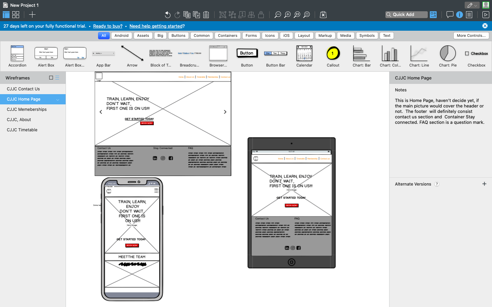
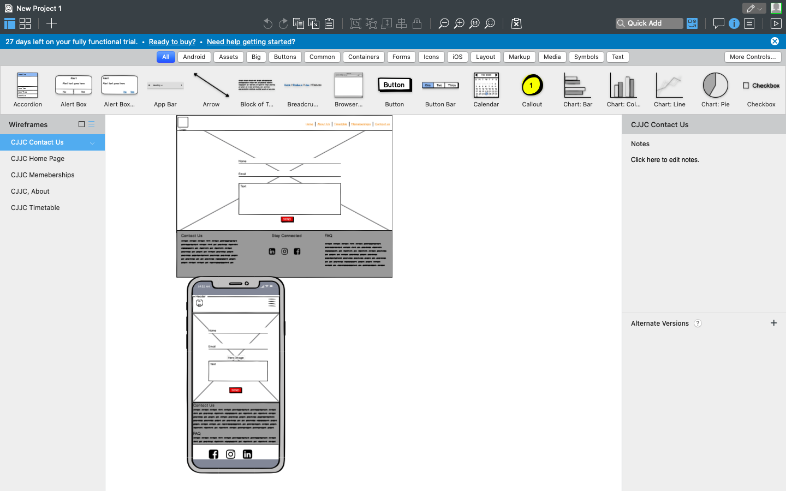
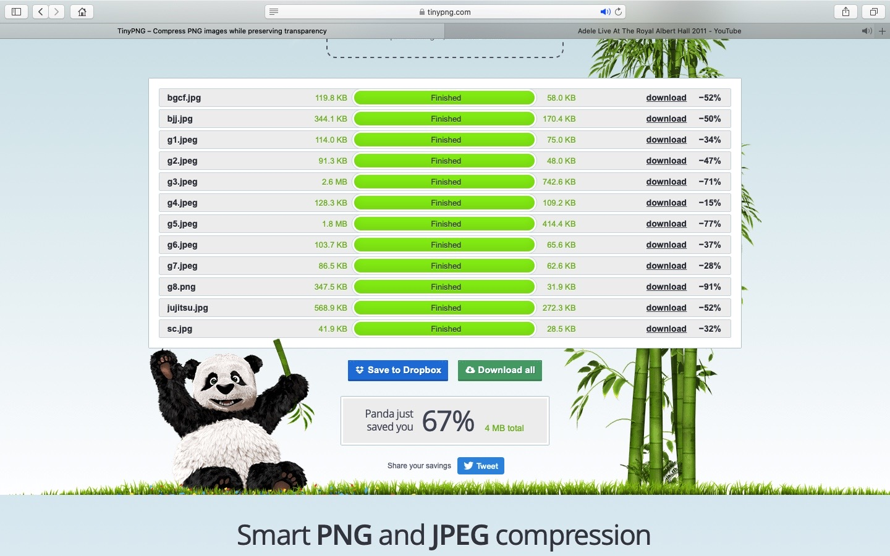
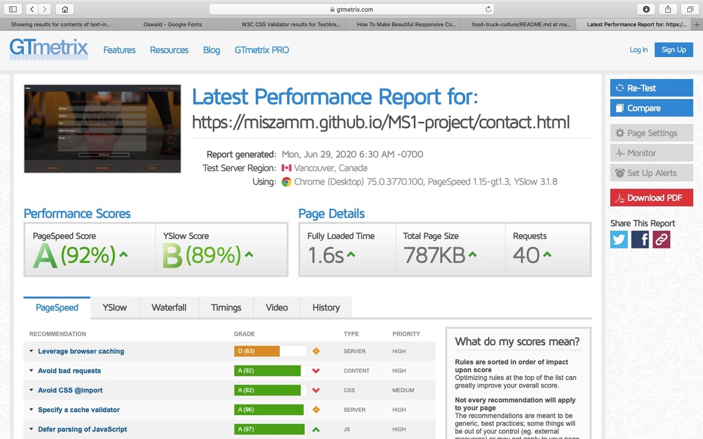

  

# Description

>Callan Martial art and S&C Center is a club providing Ju-Jitsu Traditional, Brazilian Jiu-Jitsu and strength and conditioning classes for all age groups. We offer personal, semi personal and corporate classes.

>Fully qualified instructors offer excellent proffessional advice and wide range of classes to accomodate customers with different requirements and abilities. 
Our continious growth is based on ongoing self educational, intelectual and physical developemnt to provide the best service for our customers.

# Deployment and Demo

Website has been deployed to [GitHub Pages](https://miszamm.github.io/MS1-project/contact.html).

# Wireframe

The wireframe was designed using [Balsamiq](https://balsamiq.com/wireframes/) and screeshots could be found below:

- 
- 

# UX

I have used simple and responsive design to minimise loading time of the page.

- Home page: Home page contains Carusel with inner jumbotron for the main section and additional jumbotron bellow which could be resized depend on user viewport size.
- Contact page: Contact page contains a contact form with submit button and background image.
- Gallery Page: Contains photos with transform option when user hover over the picture and optional slide show when click on the image. To create desire effect js magnificPopup function was used.
- Timetable: Timetable contains clickable tabs with days of the week and container below with relevant content for each tab. Below there is a jumbotron with call to action botton.

In order to improve user experience and website loading speed, to  compressed the images i used [tinypng.com](https://tinypng.com/) and the reduction in image size has been 67%.

# Visual Identity

- [Logo](https://krita.org/en/) for the logo design I used Krita-open source professional painting program.

# User Stories
Users:
- As a user, I'd like to start to use servives to buils confidence
- As a user, I'd like to contact the center to work on my physicality
- As a user, I'd like to see who are the coaches of the company and what they offer
- As a user, I'd like to join in and be part of the club/team
Bussiness owner:
- As a business owner, I'd like to list my services in the site
- As a business owner, I'd like to increase trafic going thrue the website to increase revenue
- As a business owner, I'd like to access the members area
- As a business owner, I'd like to connect with other businesses and to promote what bussines have to offer

# Testing

Website has been tested using [GTmetrix](https://gtmetrix.com/reports/miszamm.github.io/uxCtpG3y) and [BrowserStack](), see results below:

[Website Speed Test Results](https://www.browserstack.com/)
The points below can be improved with a bit more optimization:
- Serving scaled images (some images are being resized in CSS e.g. logo.png)
- Leveraging browser caching

# Scalability

Using a back-end programming language and database, I'd like to have a fully featured CMS which can be used by non-technical people to create, read, update and delete data easily.
Also, I'd like franchise owners to have a private section where they can find resources and talk directly to our customer service representatives.

# Technologies

- [HTML](https://developer.mozilla.org/en-US/docs/Web/HTML)
- [CSS](https://developer.mozilla.org/en-US/docs/Web/CSS)
- [JavaScript](https://www.w3schools.com/js/)
- [Bootstrap](https://getbootstrap.com/)
- [jQuery](https://jquery.com/)

# Media

I have used different resources for images and my logo, I'll list all below:
- [Krita](https://krita.org/en/) for the logo design . 
- [Unsplash](https://unsplash.com) for all the images
- [Font Awesome](https://fontawesome.com) for the icons used on this site.

# Thanks to 

- Code Institut for the oportunity 
- my mentor Felipe Souza for all the guidlines with creations of my first project
- Slac comunity
- Unspalsh.com for the fantastic pictures 
- Bootstrap crew for developement and maintanace of the library

# License

MIT License

Copyright (c) [2020] [Michal Miszkurka]

Permission is hereby granted, free of charge, to any person obtaining a copy
of this software and associated documentation files (the "Software"), to deal
in the Software without restriction, including without limitation the rights
to use, copy, modify, merge, publish, distribute, sublicense, and/or sell
copies of the Software, and to permit persons to whom the Software is
furnished to do so, subject to the following conditions:

The above copyright notice and this permission notice shall be included in all
copies or substantial portions of the Software.

THE SOFTWARE IS PROVIDED "AS IS", WITHOUT WARRANTY OF ANY KIND, EXPRESS OR
IMPLIED, INCLUDING BUT NOT LIMITED TO THE WARRANTIES OF MERCHANTABILITY,
FITNESS FOR A PARTICULAR PURPOSE AND NONINFRINGEMENT. IN NO EVENT SHALL THE
AUTHORS OR COPYRIGHT HOLDERS BE LIABLE FOR ANY CLAIM, DAMAGES OR OTHER
LIABILITY, WHETHER IN AN ACTION OF CONTRACT, TORT OR OTHERWISE, ARISING FROM,
OUT OF OR IN CONNECTION WITH THE SOFTWARE OR THE USE OR OTHER DEALINGS IN THE
SOFTWARE.
